<h1 align="center">Diego Ayala</h1>

  Informatics Engineering · Applied ML · Data Science 
  Lima, Perú · <a href="https://www.linkedin.com/in/diego4yala/">LinkedIn</a> · etadiegoayala17@gmail.com

  
  
  
  
  
  

---

### About

Computer Engineering undergraduate turning raw data into robust predictive systems — applied machine learning, Explainable AI (XAI), and Natural Language Processing. Currently researching transparent XAI models for credit risk assessment and exploring constrained NLP translation, while building ensemble architectures for complex spatial-temporal data.

`> open to research collaboration`

---

### Core Skills

  

---

### Contribution Activity

  <picture>
    <source media="(prefers-color-scheme: dark)" srcset="https://raw.githubusercontent.com/diego4yala/diego4yala/output/github-contribution-grid-snake-dark.svg" />
    <source media="(prefers-color-scheme: light)" srcset="https://raw.githubusercontent.com/diego4yala/diego4yala/output/github-contribution-grid-snake.svg" />
    
  </picture>

Generated automatically every day by a GitHub Action in this repo (<code>.github/workflows/snake.yml</code>) — updates the first time the workflow runs.

---

### Featured Projects

- **[Power Outage Forecasting — ENIGMA ML Competition](https://github.com/diego4yala/ENIGMA-ML-Competition)** — LightGBM multi-origin model plus a residual model for unseen zones, forecasting per-user electricity interruption hours by zone over the next 12 months. 1st place, ENIGMA ML Competition (Kaggle), RMSLE 0.82468.

---

  
  

